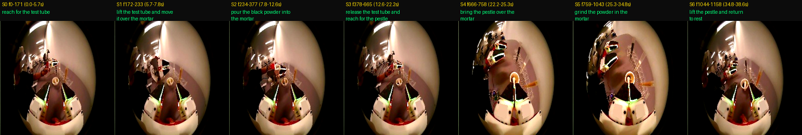

# black-smash 子任务标注 · Subtask Annotation
### “Pour the black powder into the mortar and grind.”


> **中文** ｜ 对一个双臂操作数据集(LeRobot v2.1)做**时序子任务分段**:每条 episode 都是同一个长程任务,本仓库把每帧自动标注成 5 个连续子任务。分段依据是机器人**本体感知信号**(`observation.state`),而不是相机——场景相机是低照度鱼眼、不可靠,而状态信号能干净地暴露出「抓取/松手」和「研磨」。
>
> **EN** ｜ Temporal **subtask segmentation** for a bimanual manipulation dataset (LeRobot v2.1). Every episode is the same long-horizon task; this repo auto-labels each frame into 5 contiguous subtasks. Boundaries come from the robot's **proprioceptive signal** (`observation.state`), not the cameras — the scene cameras are low-light fisheye and unreliable, while the state stream cleanly exposes grasp/release and grinding.



---

## 目录 · Table of Contents
1. [概述 · Overview](#概述--overview)
2. [任务与子任务 · Task & Subtasks](#任务与子任务--task--subtasks)
3. [数据集 · Dataset](#数据集--dataset)
4. [方法 · Method](#方法--method)
5. [环境与安装 · Setup](#环境与安装--setup)
6. [用法 · Usage](#用法--usage)
7. [输出 · Outputs](#输出--outputs)
8. [结果 · Results](#结果--results)
9. [脚本 · Scripts](#脚本--scripts)
10. [已知局限 · Known Limitations](#已知局限--known-limitations)
11. [复现 · Reproduction](#复现--reproduction)

---

## 概述 · Overview

**中文** — 目标只有一个:**把每条 episode 切成有意义的子任务**,产出可直接当作训练标签的逐帧序列。不追求亚帧级的边界精度,而是要稳、可批量、可复现。整套分段不看图(快、跨集稳定),只在开发阶段用增强后的 `camera1` 关键帧做人工抽查。

**EN** — One goal: **segment each episode into meaningful subtasks** and emit a per-frame label sequence usable directly as a training target. We don't chase sub-frame boundary precision; we want it robust, batchable, and reproducible. Segmentation never reads pixels (fast, consistent across episodes); enhanced `camera1` keyframes are used only for human spot-checks during development.

---

## 任务与子任务 · Task & Subtasks

数据集只有一个任务 / single task: **`Pour the black powder into the mortar and grind.`**
被分为 5 个连续子任务 / split into 5 contiguous subtasks:

| id | label (写入数据 · stored in data) | 中文 |
|----|-----------------------------------|------|
| S0 | `reach for and grasp the powder container` | 伸手抓取粉末容器 |
| S1 | `pour the black powder into the mortar` | 把黑色粉末倒入研钵 |
| S2 | `set down the container and bring the pestle to the mortar` | 放下容器、把杵移到研钵 |
| S3 | `grind the powder in the mortar` | 研磨研钵中的粉末 |
| S4 | `lift the pestle and return to rest` | 抬起杵、收回 |

> 标签固定在 `batch_annotate.py` 顶部的 `LABELS`,改措辞改那里即可。
> Labels are fixed in `LABELS` at the top of `batch_annotate.py`; edit there to reword.

---

## 数据集 · Dataset

**中文** — `black_smash_07/` 是 LeRobot v2.1 双臂数据集,**100 条 episode**,单一任务,每条约 1000–1266 帧,30 fps。它**不包含在仓库里**(约 4.3 GB,已 gitignore)——把脚本指向你本地的副本即可。

**EN** — `black_smash_07/` is a LeRobot v2.1 bimanual dataset, **100 episodes**, single task, ~1000–1266 frames each, 30 fps. It is **not in the repo** (~4.3 GB, gitignored) — point the scripts at your local copy.

特征 / features (`meta/info.json`):

| feature | dtype | shape | 说明 · note |
|---------|-------|-------|------|
| `observation.images.camera0`, `camera1` | image | 224×224×3 | 场景相机(低照度鱼眼)· scene cams (low-light fisheye) |
| `observation.images.tactile_{left,right}_{0,1}` | image | 224×224×3 | 4 路触觉(GelSight 类)· 4 tactile streams |
| `observation.state` | float32 | (20,) | 本体状态;**分段用它** · proprioceptive state; **used for segmentation** |
| `actions` | float32 | (20,) | 动作 · actions |
| `timestamp` | float32 | (1,) | 均匀 `frame_idx/30` · uniform |

目录结构 / layout: `data/chunk-000/episode_{NNNNNN}.parquet` · 元数据 / meta: `meta/{info,episodes,episodes_stats,tasks}.jsonl/json`。

---

## 方法 · Method

所有边界都来自 20 维 `observation.state` 时间序列,用**帧序号**表示(与帧率无关),开发时再用增强 `camera1` 关键帧抽查。
All boundaries are derived from the 20-dim `observation.state` series, expressed in **frame indices** (rate-independent), spot-checked against enhanced `camera1` keyframes.

记 4 个内部边界 / four internal boundaries: `b1`(抓取 grasp)、`b2`(松手 release)、`b3`(研磨开始 grind-start)、`b4`(研磨结束 grind-end)。
分段 / segments:`S0=[0,b1-1]`、`S1=[b1,b2]`、`S2=[b2+1,b3-1]`、`S3=[b3,b4]`、`S4=[b4+1,N-1]`。

### 1) 抓取 / 松手 · Grasp (`b1`) / Release (`b2`)

**中文** — 倒粉末的过程中,状态**第 3 维**会从静息值发生一次**短暂的双峰态偏离**(抓住容器→保持→放回)。做法:把 dim 3 用 1/99 百分位归一化到 `[0,1]`,取静息值为前 `T/20` 帧的中位数,当 `|g − rest| > 0.5` 视为「介入态」,只在前 70% 里找**最长**的那一段——它的起止就是 `b1/b2`。这是最可靠的信号(双峰切换非常干净)。

**EN** — During the pour, state **dim 3** makes a transient **bimodal deviation** from its resting value (grasp → hold → set back). Normalize dim 3 to `[0,1]` (1st/99th pct), take the resting value as the median of the first `T/20` frames, mark frames with `|g − rest| > 0.5` as "engaged", and take the **longest** such run within the first 70% of the episode — its ends are `b1/b2`. Most reliable signal (clean bimodal flip).

### 2) 研磨 · Grind (`b3` → `b4`)

**中文** — 研磨 = **原地运动**:末端有速度,但「载波漂移」很低。载波 = 位姿的 ~1s 滑动均值;漂移 = 载波的速度。搬运阶段是平移(高漂移)→排除;最后抬杵是高漂移→排除;最后静止是低速度→排除。判定 `grind_ok = (drift < 第40百分位) 且 (raw > 0.12·max raw)`,只取 `b2` 之后,桥接 < 1.2s 的研磨内短暂停顿,取**最长连续段**即 `[b3,b4]`。

**EN** — Grinding is **motion in place**: nonzero end-effector speed but low *carrier drift*. Carrier = ~1 s rolling mean of the pose; drift = speed of the carrier. Transport translates the arm (high drift, excluded); the final lift is high-drift (excluded); the final rest is low-speed (excluded). `grind_ok = (drift < 40th pct) AND (raw > 0.12·max raw)`, restricted to after `b2`, with mid-grind pauses < 1.2 s bridged; the **longest contiguous block** is `[b3,b4]`.

信号定义 / signal definitions(`fps=30`):pose = 除 `[3,4]` 外的 18 维并标准化;`raw` = `‖Δpose‖` 经 0.3s 平滑;`carrier` = 各维 1.0s 滑动均值;`drift` = `‖Δcarrier‖` 经 0.3s 平滑。

### 3) 容错与异常标记 · Fallbacks & flags

| 情况 · case | 处理 · handling |
|------|------|
| 找不到/过短的抓取窗 · no/short engage window | 按比例回退 10%/30% + `flag` · proportional fallback + `flag` |
| 找不到研磨段(<0.8s)· no grind run | 按比例回退 62%/92% + `flag` · proportional fallback + `flag` |
| 边界顺序不满足 `0<b1<b2<b3<b4<N-1` · ordering off | 强制比例分段 16/32/62/90% + `flag` |

> 规模化 QA = 只看 `flags` 非空的那几条。当前 40 集 **0 个 flag**。
> QA at scale = review only episodes with a non-empty `flags`. Current 40 episodes: **0 flagged**.

---

## 环境与安装 · Setup

**中文** — 只需 Python + `pandas`、`numpy`、`Pillow`(**不需要** matplotlib / scipy)。本机用 conda 环境 `vlm`(裸 `python` 是失效的 Microsoft Store stub,务必用全路径):

**EN** — Just Python + `pandas`, `numpy`, `Pillow` (**no** matplotlib / scipy). On this machine use the conda env `vlm` (bare `python` is a dead Microsoft Store stub — use the full path):

```powershell
& "C:\Users\jerry\miniconda3\envs\vlm\python.exe" batch_annotate.py
```

其它机器 / elsewhere: `pip install pandas numpy pillow` 后用 `python batch_annotate.py`。

---

## 用法 · Usage

```bash
# 标注 data 目录下找到的所有 episode(只读 state 列,很快)
# annotate every episode under the data dir (state-only, fast)
python batch_annotate.py

# 额外为每集生成 QA 抽查图(会解码 camera1,较慢)
# also emit a per-episode QA storyboard (decodes camera1, slower)
python batch_annotate.py --storyboard

# 子集 / 自定义路径 / 不同帧率
# subset / custom paths / different fps
python batch_annotate.py --eps 0,5,9
python batch_annotate.py --data /path/to/chunk-000 --out /path/to/out --fps 30
```

| 参数 · flag | 默认 · default | 说明 · description |
|------|---------|------|
| `--data` | `…\black_smash_07\data\chunk-000` | episode parquet 所在目录 · dir of episode parquets |
| `--out` | `…\mvt_annotations` | 输出目录 · output dir |
| `--meta` | `…\meta\tasks.jsonl` | 读取任务字符串 · source of the task string |
| `--fps` | `30` | 仅影响输出秒数 · only affects reported seconds |
| `--eps` | (全部 · all) | 逗号分隔的 episode 序号 · comma list of indices |
| `--storyboard` | off | 生成每集抽查图 · emit storyboards |

---

## 输出 · Outputs (`mvt_annotations/`)

| 文件 · file | 内容 · contents |
|------|------|
| `ep<NNN>_subtasks.json` | 每集分段:`subtasks[]`(`label`、`start_frame`/`end_frame`、`start_t`/`end_t`、`dur_s`)+ `boundaries` + `flags` |
| `ep<NNN>_subtask_index.npy` | `int16` 数组,长度 = 帧数,每帧的子任务 id(可直接作训练标签列)· per-frame subtask id |
| `summary.csv` | 每集一行:边界帧 + 各段时长 + flags · one row per episode |
| `all_subtasks.jsonl` | 所有 per-episode JSON,一行一条 · all docs, one per line |
| `ep<NNN>_storyboard.png` | 每个子任务一张代表帧(需 `--storyboard`)· representative frame per subtask |

`ep<NNN>_subtasks.json` 结构 / schema:

```json
{
  "episode_index": 0,
  "task": "Pour the black powder into the mortar and grind.",
  "n_frames": 1159, "fps": 30,
  "method": "signal-derived (state-dim3 pour deviation + carrier-drift grind)",
  "boundaries": {"b1": 187, "b2": 365, "b3": 758, "b4": 1023},
  "flags": [],
  "n_subtasks": 5,
  "subtasks": [
    {"subtask_id": 0, "label": "reach for and grasp the powder container",
     "start_frame": 0, "end_frame": 186, "start_t": 0.0, "end_t": 6.2,
     "n_frames": 187, "dur_s": 6.23}
  ]
}
```

`summary.csv` 列 / columns:
`episode, n_frames, b1_grasp, b2_release, b3_grindStart, b4_grindEnd, S0_s, S1_s, S2_s, S3_s, S4_s, flags`

逐帧标签用法 / using the per-frame labels:

```python
import numpy as np
y = np.load("mvt_annotations/ep000_subtask_index.npy")  # shape (n_frames,), int16 in 0..4
```

---

## 结果 · Results

在已下载的 **40 条** episode 上(每条 1049–1266 帧,均值 ~1168;总时长 ~38.9s):**0 个 flag**,各子任务时长跨集高度一致。
On the **40** downloaded episodes (1049–1266 frames each, mean ~1168; total ~38.9 s): **0 flagged**, per-subtask durations are tight and consistent.

| 子任务 · subtask | 均值 mean (s) | 范围 range (s) |
|------|------|------|
| S0 reach+grasp | 6.4 | 5.5 – 7.4 |
| S1 pour | 6.3 | 4.6 – 9.0 |
| S2 setdown+fetch pestle | 11.8 | 10.0 – 14.0 |
| S3 grind | 9.6 | 7.2 – 12.5 |
| S4 lift+rest | 4.8 | 3.2 – 7.8 |

> 注:数据集 100 条,目前下载了 40 条;其余下载完重跑同一条命令即可覆盖全量。
> Note: 100 episodes total, 40 downloaded so far; re-run the same command to cover the rest once downloaded.

---

## 脚本 · Scripts

| 脚本 · script | 作用 · role |
|------|------|
| `batch_annotate.py` | **主工具** · main tool — 自动分段全部 episode,写 JSON/npy/CSV,标记异常 |
| `annotate_ep.py` | 单集参考标注器(ep000 手工细化边界)· single-episode reference annotator |
| `analyze_subtasks.py` | 诊断 · diagnostic — 打印某集的逐秒时间线(夹爪/速度/振荡)+ 检测到的事件 |
| `inspect_episode.py` | 数据集检查 · dataset inspector — schema、图像列、抽帧 |

---

## 已知局限 · Known Limitations

- **中文**
  - 最可靠的是 `b1/b2`(抓取/松手);**最软的是 S2↔S3**(搬杵到位→开始磨是渐变,约 ±0.5s)。
  - 相机是低照度鱼眼,所以标注主要靠本体感知信号,不靠像素。
  - `ENGAGE_DIM=3` 是针对**本数据集本体**验证出来的(40 集稳定);换数据集/换机器人需要重新确认这个维度。
  - 帧率以帧序号为准;`info.json` 的 fps 只影响输出秒数(时间戳是均匀的 `frame_idx/30`)。
  - 标签为单一任务的固定 5 类,写死在 `LABELS`。
- **EN**
  - Most reliable boundary is `b1/b2` (grasp/release); the **softest is S2↔S3** (transport→grind is gradual, ~±0.5 s).
  - Cameras are low-light fisheye, so labeling leans on proprioception, not pixels.
  - `ENGAGE_DIM=3` was validated for **this** embodiment (stable over 40 episodes); a different dataset/robot needs this dim re-checked.
  - Segmentation is in frame indices; the `info.json` fps only affects reported seconds (timestamps are uniform `frame_idx/30`).
  - Labels are a fixed 5-class taxonomy for the single task, hardcoded in `LABELS`.

---

## 复现 · Reproduction

```bash
# 1. 准备数据集(本仓库不含)· obtain the dataset (not in this repo)
#    放到 ./black_smash_07/data/chunk-000/episode_*.parquet
# 2. 安装依赖 · install deps
pip install pandas numpy pillow
# 3. 运行 · run
python batch_annotate.py --data ./black_smash_07/data/chunk-000 --out ./mvt_annotations
# 4. 看汇总与异常 · inspect summary & flags
#    ./mvt_annotations/summary.csv  (末尾 flagged 列表 / flagged list printed at end)
```

单集调试 / single-episode debugging:`python analyze_subtasks.py <episode.parquet>` 会打印逐秒信号时间线和事件,便于核对某一集的边界。
