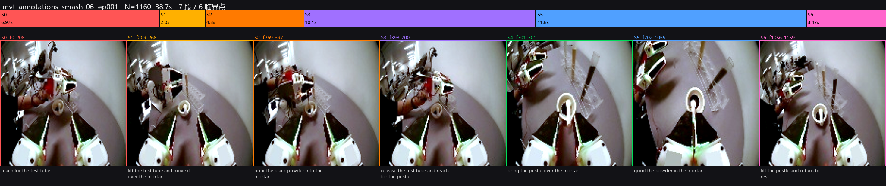

# Proprioception-Grounded Subtask Segmentation for Long-Horizon Bimanual Manipulation

Per-frame subtask labels are useful supervision for hierarchical and
subtask-conditioned manipulation policies, but hand-annotating long-horizon
episodes is costly. On a long-horizon bimanual task — *pour black powder from a
test tube into a mortar, then grind* (LeRobot v2.1) — we find that **proprioception
(`observation.state`) recovers subtask boundaries at sub-second accuracy precisely
where the on-board cameras (low-light, fisheye) are unreliable.** We combine this
signal-based segmenter with a vision–language prior and disagreement-triggered
human review, and label each episode as **7 subtasks delimited by 6 critical points**.


*Per-episode visualization: subtask timeline (top) and one keyframe per subtask
(center-cropped + white-balanced).*

## Approach

A three-stage pipeline assigns each critical point to the modality that localizes
it best, and routes only the ambiguous points to a human:

```
Stage 1  VLM (Qwen2.5-VL)        semantic prior from frames   → mvt_annotations_vlm/
Stage 2  proprioceptive signal   precise boundaries           → mvt_annotations/
         fusion (per-point)      confidence = |VLM − state|   → mvt_annotations_fused/
Stage 3  human-in-the-loop       review flagged points only   → mvt_annotations_human/
```

**Stage 2 — proprioceptive segmentation (primary).** Boundaries are derived from
the 20-D `observation.state` in frame index (rate-independent), never from pixels:

- *Gripper events.* The two arms mirror with a +10 offset (tube gripper = `dim 3`,
  pestle gripper = `dim 13`). After percentile normalization, "closed" = deviation
  from the resting (open) value; the longest closed run (with morphological gap
  closing) gives **grasp** (run start) and **release** (run end). → p1, p3, p4.
- *Grinding vs. transport.* From the non-gripper dims we form a pose `P`; `raw` is
  its per-frame speed, `carrier` its ~1 s rolling mean, and `drift` the carrier
  speed (translation). **Grinding = high `raw`, low `drift`** (the arm oscillates
  in place over the mortar without translating); transport has high `drift`. The
  longest in-place-motion run gives grind **start** / **end**. → p5, p6.
- *Pour onset (p2).* No hard proprioceptive signature exists (powder flow is a
  visual/wrist event); we use the onset of the low-drift "settled over the mortar"
  window as a proxy. This is the one boundary proprioception cannot pin precisely.

**Stage 1 — VLM prior.** `Qwen2.5-VL` (transformers or a vLLM/OpenAI endpoint)
reads contrast-enhanced, center-cropped frames and proposes the 6 points; it owns
the visual point (p2) and cross-checks the rest. For p2, the pipeline can use a
state-guided temporal refinement pass: state narrows the search to the tube-held
pour window, then Qwen sees chronological before/after frames and selects the
first visible powder-flow frame.

**Stage 3 — fusion + targeted review.** Each point takes its owner modality's
value; points where `|VLM − state| > τ` are flagged as `review_points`, so human
effort concentrates on the few ambiguous boundaries.

## Findings (preliminary)

- **Robustness.** State-based segmentation runs on **382 episodes across 3
  datasets with 0 fallback flags**; all critical points strictly ordered.
- **Per-point accuracy** (signal-level inspection):

  | critical point | signal | reliability |
  |---|---|---|
  | p1 grasp tube / p3 release tube / p4 grasp pestle | gripper (dim 3 / 13) | **strong, sub-second** (p3 ≈ 0.4 s) |
  | p5 start grind / p6 lift pestle | `raw`-vs-`drift` | medium (p6 softer; grind tail is gradual) |
  | p2 start pour | low-drift proxy | **weak** — visual event, absent from proprioception |

- **Vision is not a shortcut here.** On the same low-light/fisheye footage,
  `Qwen2.5-VL-3B` cannot localize events (≈ **14 s** mean boundary error; outputs
  near-arithmetic guesses), motivating the proprioception-first design.
- **7B VLM (preliminary, Linux + RTX 5080).** `Qwen2.5-VL-7B-Instruct-AWQ` via
  vLLM 0.23 on `black_smash_07` ep0–2 (~6 s/episode, coarse+fine, 32 frames):
  outputs are **not** evenly spaced (unlike 3B), but remain **coarse** vs.
  proprioception — mean |VLM − state| ≈ **3.7 s** across 18 boundaries (max
  12.4 s on ep2 `lift_pestle`); **17/18** exceed the 0.5 s fusion tolerance,
  so Stage 3 review is still needed. Sample outputs:
  [`examples/sample_ep000_vlm_subtasks.json`](examples/sample_ep000_vlm_subtasks.json)
  (state reference: [`examples/sample_ep000_subtasks.json`](examples/sample_ep000_subtasks.json)).

## Task and subtask taxonomy

Labels live in `LABELS` (`batch_annotate.py`) and are shared by all stages.
Example output format: [`examples/sample_ep000_subtasks.json`](examples/sample_ep000_subtasks.json).

| | subtask | start critical point |
|---|---|---|
| S0 | reach for the test tube | (0) |
| S1 | lift the test tube and move it over the mortar | p1 grasp tube (dim 3) |
| S2 | pour the black powder into the mortar | p2 start pour (visual) |
| S3 | release the test tube and reach for the pestle | p3 release tube (dim 3) |
| S4 | bring the pestle over the mortar | p4 grasp pestle (dim 13) |
| S5 | grind the powder in the mortar | p5 start grind (motion) |
| S6 | lift the pestle and return to rest | p6 lift pestle (motion) |

Each episode produces `ep<NNN>_subtasks.json` (`critical_points`(6),
`subtask_starts`(7), 7 `subtasks`; fused adds `sources`/`disagree_frames`/
`review_points`) and `ep<NNN>_subtask_index.npy` (per-frame id 0–6, usable
directly as policy supervision).

## Repository

| file | role |
|---|---|
| `batch_annotate.py` | Stage 2 — proprioceptive segmentation |
| `vlm_annotate.py` | Stage 1 — Qwen2.5-VL (`--backend qwen-local`/`openai`); `test_qwen_vl.py` smoke test |
| `fuse_annotations.py` | per-point fusion + disagreement flagging |
| `scripts/run_annotation_pipeline.sh` | end-to-end state / Qwen / fused / visualization pipeline for one dataset |
| `annotate_gui.py` | Stage 3 — human review GUI |
| `visualize_annotation.py`, `zoom_boundary.py` | timeline/keyframe and boundary-zoom visualization |
| `visualize_annotation_tracks.py` | same-image comparison of state, Qwen, fused, and optional Gemini tracks |
| `outlier_report.py`, `compare_timelines.py`, `verify_tail.py` | QA / consistency checks |
| `analyze_subtasks.py`, `inspect_episode.py` | diagnostics |
| `docs/INSTALL_QWEN*.md` | Stage-1 setup (Windows / Linux + RTX 5080, vLLM) |
| `scripts/start_vllm.sh` | one-shot vLLM launcher (CUDA 13 env + FlashInfer symlinks) |
| `data_annotation/` | optional Gemini / OpenAI-compatible stage annotation workflow |

## End-to-End Pipeline

Start the local Qwen server in one terminal:

```bash
./scripts/start_vllm.sh /home/hillbot/models/Qwen2.5-VL-7B-Instruct-AWQ
```

Then run the reproducible pipeline from the repository root. It writes
`annotations_state_<id>/`, `annotations_qwen_<id>/`, `annotations_fused_<id>/`,
and `compare_tracks_<id>/`, all ignored by git because they are regenerable data
artifacts.

```bash
PYTHON_BIN=/home/hillbot/miniforge3/envs/qwenvl/bin/python \
DATASET_ROOT=/home/hillbot/black_smash_05 DATASET_ID=05 \
bash scripts/run_annotation_pipeline.sh

PYTHON_BIN=/home/hillbot/miniforge3/envs/qwenvl/bin/python \
DATASET_ROOT=/home/hillbot/black_smash_06 DATASET_ID=06 \
bash scripts/run_annotation_pipeline.sh

PYTHON_BIN=/home/hillbot/miniforge3/envs/qwenvl/bin/python \
DATASET_ROOT=/home/hillbot/black_smash_07 DATASET_ID=07 \
bash scripts/run_annotation_pipeline.sh
```

Useful switches:

```bash
# only a subset of episodes
EPS=0,1,2 DATASET_ROOT=/home/hillbot/black_smash_07 DATASET_ID=07 \
bash scripts/run_annotation_pipeline.sh

# reuse existing annotations and only redraw the comparison images
RUN_STATE=0 RUN_QWEN=0 RUN_FUSED=0 RUN_VIZ=1 \
DATASET_ROOT=/home/hillbot/black_smash_07 DATASET_ID=07 \
bash scripts/run_annotation_pipeline.sh

# include an existing Gemini normalized jsonl as the fourth row
GEMINI_JSONL=annotations_gemini_stage_07/run_xxx/stage_annotations_normalized.jsonl \
DATASET_ROOT=/home/hillbot/black_smash_07 DATASET_ID=07 \
bash scripts/run_annotation_pipeline.sh

# disable state-guided p2 history refinement for a stricter pure-Qwen baseline
QWEN_P2_HISTORY=0 DATASET_ROOT=/home/hillbot/black_smash_07 DATASET_ID=07 \
bash scripts/run_annotation_pipeline.sh
```

The visualization can also be called directly:

```bash
python visualize_annotation_tracks.py \
  --data /home/hillbot/black_smash_07/data/chunk-000 \
  --state annotations_state_07 \
  --qwen annotations_qwen_07 \
  --fused annotations_fused_07 \
  --out compare_tracks_07 \
  --gemini-jsonl annotations_gemini_stage_07/run_xxx/stage_annotations_normalized.jsonl
```

## Optional Gemini Stage

Gemini support lives under `data_annotation/`. Copy the example config and keep
the local file private:

```bash
cp data_annotation/config/api_env.example data_annotation/config/api_env.local.sh
# edit GEMINI_API_KEY and GEMINI_MODEL in data_annotation/config/api_env.local.sh
```

Run with the official Google Gemini API:

```bash
PROVIDER=google \
DATASET_ROOT=/home/hillbot/black_smash_07 \
META_ROOT=/home/hillbot/black_smash_07/meta \
OUT_ROOT=annotations_gemini_stage_07 \
NUM_EPISODES=100 \
FRAME_SAMPLING=uniform7 \
SIGNAL_DETAIL=compact \
PYTHON_BIN=/home/hillbot/miniforge3/envs/qwenvl/bin/python \
bash data_annotation/scripts/run_gemini_stage_annotation.sh
```

`api_env.local.sh`, annotation folders, visualization folders, and logs are
ignored by git.

## Current Local QA Summary

Latest local run across datasets 05, 06, and 07:

| dataset | episodes | state | Qwen vs state MAE | mean IoU | fused points flagged | Gemini valid |
|---|---:|---|---:|---:|---:|---:|
| 05 | 232 | complete, 0 flags | 5.32 s | 0.211 | 1299 / 1392 (93.3%) | 21 / 232 |
| 06 | 50 | complete, 0 flags | 9.33 s | 0.162 | 292 / 300 (97.3%) | 14 / 50 |
| 07 | 100 | complete, 0 flags | 9.13 s | 0.173 | 581 / 600 (96.8%) | 1 / 100 |

Interpretation: state labels are stable and complete; Qwen7B is useful as a
semantic cross-check but remains too coarse for direct boundary supervision; the
fused labels therefore mostly keep state boundaries and flag Qwen disagreements
for review. Gemini results were limited by API quota in this run, so they are
treated as an optional fourth visual track rather than a complete comparison.

## Manual Usage

```bash
# Stage 2 / 3 need only: pandas numpy pillow (+ tkinter for the GUI)
python batch_annotate.py --data <dataset>/data/chunk-000 --out mvt_annotations   # segment
python fuse_annotations.py --tol-s 0.5                                            # fuse + flag
python annotate_gui.py --ep 0                                                     # review
python visualize_annotation.py --ann mvt_annotations --data <dataset>/data/chunk-000 --eps 0

# Stage 1 (GPU): see docs/INSTALL_QWEN_LINUX.md
./scripts/start_vllm.sh   # terminal 1 — serves http://localhost:8000/v1
python vlm_annotate.py --backend openai --model qwen \
  --base-url http://localhost:8000/v1 \
  --data ~/black_smash_07/data/chunk-000 --out mvt_annotations_vlm --eps 0,1,2
```

Data: LeRobot v2.1 bimanual, ~1049–1290 frames/episode @ 30 fps, 6 image streams
(2 scene + 4 tactile, 224²) + 20-D `state`/`actions`
(`hf download EricChen06/black_smash_07 --repo-type dataset`).

## Limitations and ongoing work

- **Generalization.** Results are on one task family; gripper dims and thresholds
  are currently task-specific. Automatic dimension/structure discovery and
  evaluation across more tasks and embodiments are in progress.
- **Quantitative evaluation.** Multi-annotator gold labels (with inter-annotator
  agreement) and baselines (change-point detection, temporal action segmentation,
  VLM-only) are being added.
- **Downstream.** Using the labels to train subtask-conditioned / hierarchical
  policies (SO-100 datasets) is the planned end-to-end evaluation.

## Citation

```bibtex
@misc{subtask_segmentation,
  title  = {Proprioception-Grounded Subtask Segmentation for Long-Horizon Bimanual Manipulation},
  author = {Zhang, Rongxuan},
  year   = {2026},
  howpublished = {\url{https://github.com/Jerryzhang258/black-smash-subtask-annotation}}
}
```
