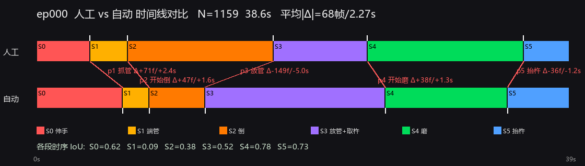

# black-smash 子任务标注
### 任务:`Pour the black powder into the mortar and grind.`(把黑色粉末倒入研钵并研磨)


对一个双臂操作数据集(LeRobot v2.1)做**时序子任务分段**:每条 episode 都是同一个长程任务,把每一帧自动标注成 **6 个连续子任务**(由 **5 个临界点**切分)。分段依据是机器人的**本体感知信号**(`observation.state`),而**不是相机画面**——场景相机是低照度鱼眼、不可靠;状态信号能干净地暴露「握管 / 倒 / 研磨」这些关键事件。配套提供:**交互式人工标注 GUI**(做金标准)和**人工 vs 自动时间线对比**(量化可信度)。


---

## 目录
1. [概述](#概述) · 2. [任务与子任务](#任务与子任务) · 3. [数据集](#数据集) · 4. [自动标注:方法](#自动标注方法)
5. [人工标注 GUI](#人工标注-gui) · 6. [人工-vs-自动对比](#人工-vs-自动对比) · 7. [质检](#质检)
8. [环境](#环境) · 9. [用法](#用法) · 10. [输出](#输出) · 11. [结果](#结果) · 12. [脚本](#脚本) · 13. [已知局限](#已知局限)

---

## 概述

目标:**把每条 episode 切成有意义的子任务**,产出可直接当训练标签的逐帧序列。要求**稳、可批量、可复现**。自动分段**不看图**(快、跨集稳),开发时只用增强后的 `camera1` 关键帧抽查。**最终管线完全不依赖任何 VLM / 神经网络模型**——纯本体信号处理,离线、纯 CPU。

为验证「标得对不对」,提供人工标注 GUI 产出金标准,并用对比工具算出人机的逐点误差。

---

## 任务与子任务

单一任务,切成 **6 个子任务**,由 **5 个临界点**划分(首=0、尾=末帧自动):

| id | 标签(写入数据的实际值) | 含义 |
|----|--------------------------|------|
| S0 | `reach for the test tube` | 伸手够试管 |
| S1 | `lift the test tube and move it over the mortar` | 端起试管移到研钵上方 |
| S2 | `pour the black powder into the mortar` | 倒粉入研钵 |
| S3 | `set down the test tube and pick up the pestle` | 放下试管、取杵 |
| S4 | `grind the powder in the mortar` | 研磨 |
| S5 | `lift the pestle and return to rest` | 抬杵收回 |

| 临界点 | 含义 | 切换 |
|---|---|---|
| p1 | 抓到试管 | S0→S1 |
| p2 | 开始倒 | S1→S2 |
| p3 | 放试管 | S2→S3 |
| p4 | 开始磨 | S3→S4 |
| p5 | 抬杵 | S4→S5 |

> 标签固定在 `batch_annotate.py` 顶部的 `LABELS`;脚本按临界点数量参数化,增减点不用大改。

---

## 数据集

`black_smash_07/` 是 LeRobot v2.1 双臂数据集,**100 条 episode**,单一任务,每条约 1049–1290 帧,30 fps。**不含在仓库**(约 4.3 GB,已 gitignore)。
6 路图像(`camera0/1` 场景 + `tactile_{left,right}_{0,1}` 触觉,均 224×224)+ 20 维 `observation.state` / `actions` + `timestamp`(均匀 `frame_idx/30`)。
下载:`hf download EricChen06/black_smash_07 --repo-type dataset --local-dir black_smash_07`。

---

## 自动标注:方法

边界全部来自 20 维 `observation.state`(用**帧序号**,与帧率无关),开发时用增强 `camera1` 抽查。

- **握管窗口 `[E1,E2]`** —— 握住试管期间,状态**第 3 维**会从静息值发生**双峰态偏离**;取前 70% 内最长的偏离段。→ `p1 抓管 = E1`,`p3 放管 = E2+1`。
- **开始倒 `p2`** —— 在 `[E1,E2]` 内,手臂从「搬运(平移=高载波漂移)」切到「在研钵上方倒(原地=低漂移)」;取窗口内最长低漂移段的起点。(载波 = 位姿 ~1s 滑动均值;漂移 = 载波速度。)
- **研磨 `[Gs,Ge]`** —— 研磨 = 原地运动:`漂移 < 第40百分位` 且 `原始速度 > 0.12×最大`;取 `E2` 之后、桥接 <1.2s 短停顿后的最长连续段。→ `p4 开始磨 = Gs`,`p5 抬杵 = Ge+1`。
- **容错**:任一窗口找不到 / 临界点非递增 → 按比例回退并写入 `flags`。规模化质检只看 `flags` 非空的几条(当前 100 集 **0 个**)。

---

## 人工标注 GUI

`annotate_gui.py` —— **像放视频一样**标注金标准,用于验证自动标注。

- **同屏 6 路画面**:上排 cam0/cam1,下排 4 路触觉(触觉最能判断接触/受力 → 抓管、倒、研磨)。
- 播放 / 单帧步进,按 **1–5** 在当前帧打 5 个临界点;时间轴实时画出 6 段。
- 存到 `mvt_annotations_human/`,**与自动标注同字段**(`critical_points` / `subtask_starts` / 6 段)。
- **故意不显示自动边界** → 人工标是「盲标」,对比才公正。

| 键 | 作用 | 键 | 作用 |
|---|---|---|---|
| 空格 | 播放/暂停 | **1–5** | 打临界点(抓管/开始倒/放管/开始磨/抬杵) |
| ← → | 单帧 | Shift+1~5 | 清除该点 |
| , . | 跳 ±10 帧 | 0 | 清空 |
| Home/End | 首/尾帧 | s | 保存 |
| +/− | 播放速度 | n / p | 下/上一集(自动存) |

```powershell
& "C:\Users\jerry\miniconda3\envs\vlm\python.exe" annotate_gui.py --ep 0          # 默认全 6 画面
& "...python.exe" annotate_gui.py --ep 5 --layout cam1                            # 只看一个相机
```

---

## 人工 vs 自动对比

`compare_timelines.py` —— 对每个**同时有人工+自动**标注的 episode,画上下两条对齐时间线,5 个临界点用斜线连起来标 **帧差 Δ**,并算**各段时序 IoU**;最后给出全数据集每个临界点的**平均绝对误差(MAE)**。



**ep000 实测**(人工金标准 vs 自动):磨(S4 IoU=0.78)、抬杵(S5 IoU=0.73)**高度吻合**;分歧集中在 **p3 放管(Δ≈−5s)**——自动的「握管信号」早于人眼判定的放下时刻回落,导致自动把「倒」判短。这正是信号法的盲点,人工金标准补上。

```powershell
& "...python.exe" compare_timelines.py            # 所有有双标注的集
& "...python.exe" compare_timelines.py --ep 0
```

---

## 质检

- `outlier_report.py` —— 跨集一致性 / 离群检测(robust modified-z,按临界点位置与各段时长占比),挑出可疑集。当前 100 集挑出约 14 集,集中在研磨收尾(渐变所致),非错标。
- `verify_tail.py` —— 把某集「研磨→收尾」放大渲染、标出边界,人工核验。

---

## 环境

只需 Python + `pandas`、`numpy`、`Pillow`(GUI 还需 `tkinter`,标准库自带;对比图用系统中文字体)。**不需要** matplotlib / scipy / 任何模型 / 联网。
本机用 conda 环境 `vlm`(裸 `python` 是失效的 Microsoft Store stub,务必全路径);「vlm」只是环境名,与「调用 VLM」无关。其它机器:`pip install pandas numpy pillow`。

---

## 用法

```bash
python batch_annotate.py                 # 自动标注所有 episode(只读 state,快)
python batch_annotate.py --storyboard    # 额外出 6 格质检故事板(解码 camera1,慢)
python batch_annotate.py --eps 0,5,9     # 子集(不会覆盖全量 summary.csv)
python annotate_gui.py --ep 0            # 人工标注 GUI
python compare_timelines.py              # 人工 vs 自动对比
python outlier_report.py                 # 离群质检
```

---

## 输出

**自动**:`mvt_annotations/` · **人工**:`mvt_annotations_human/`(同结构)· **对比图**:`mvt_compare/`(已 gitignore)

| 文件 | 内容 |
|------|------|
| `ep<NNN>_subtasks.json` | `critical_points`(5)+ `subtask_starts`(6)+ 6 段 `subtasks`(`label`/`start_frame`/`end_frame`/`dur_s`…)+ `flags` |
| `ep<NNN>_subtask_index.npy` | `int16`,长度=帧数,每帧子任务 id(0..5),可直接当训练标签 |
| `summary.csv` | 每集一行:`p1..p5` 临界点帧 + `S0_s..S5_s` 段时长 + flags |
| `all_subtasks.jsonl` | 所有单集 JSON,一行一条 |

```json
{
  "episode_index": 0, "n_frames": 1159, "fps": 30, "annotator": "auto-signal",
  "critical_points": [187, 245, 366, 758, 1024],
  "subtask_starts": [0, 187, 245, 366, 758, 1024],
  "n_subtasks": 6,
  "subtasks": [{"subtask_id": 0, "label": "reach for the test tube",
                "start_frame": 0, "end_frame": 186, "dur_s": 6.23, "...": "..."}]
}
```

---

## 结果

全部 **100 条** episode 自动标注完(1049–1290 帧,均值 ~1169):**0 个 pipeline flag**,各段时长跨集一致。

| 子任务 | 均值 (s) | 范围 (s) |
|------|------|------|
| S0 伸手够试管 | 6.4 | 5.4 – 7.7 |
| S1 端试管到研钵 | 2.1 | 1.4 – 3.7 |
| S2 倒 | 4.2 | 3.1 – 6.3 |
| S3 放试管+取杵 | 11.8 | 10.0 – 16.0 |
| S4 研磨 | 9.5 | 5.8 – 12.5 |
| S5 抬杵收回 | 5.0 | 3.2 – 9.0 |

---

## 脚本

| 脚本 | 作用 |
|------|------|
| `batch_annotate.py` | **主工具**——自动分段全部 episode(6 段),写 JSON/npy/CSV,标记异常 |
| `annotate_gui.py` | **人工标注 GUI**——全 6 画面、按 1–5 打临界点,出金标准 |
| `compare_timelines.py` | **人工 vs 自动**时间线对比 + 帧误差 / IoU |
| `outlier_report.py` | 质检——跨集一致性 / 离群检测 |
| `verify_tail.py` | 质检——某集研磨→收尾放大核验 |
| `analyze_subtasks.py` | 诊断——单集逐秒信号时间线 + 事件 |
| `inspect_episode.py` | 数据集检查——schema、图像列、抽帧 |

---

## 已知局限

- 最可靠的是研磨/抬杵(S4/S5,人机 IoU≈0.75+);最软的是**握管→倒→放管**那段:`p1 抓管` 比人工晚约 2s(信号需姿态变化累积才触发)、`p3 放管` 分歧最大(信号回落早于人眼判定)。
- 相机是低照度鱼眼,标注靠本体信号、不靠像素。
- `ENGAGE_DIM = 3` 针对**本数据集本体**验证(100 集稳定);换数据集 / 机器人需重新确认该维度。
- 分段以帧序号为准;`info.json` 的 fps 只影响输出秒数。
- 标签为单一任务固定 6 类,写死在 `LABELS`。
